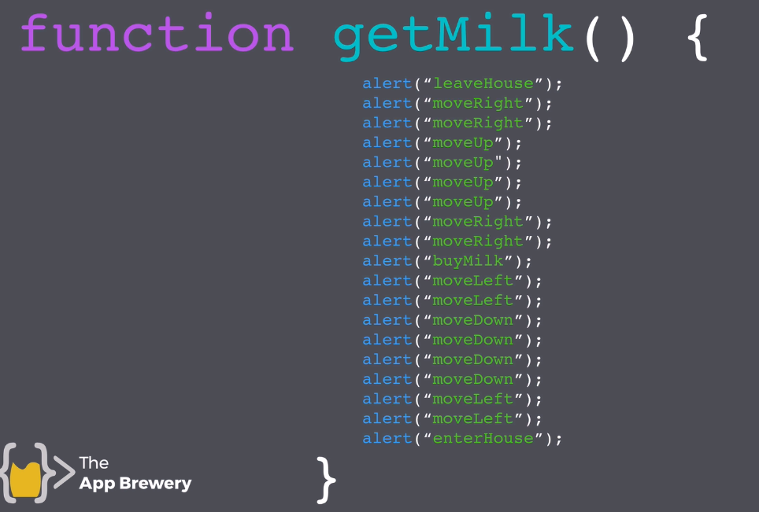
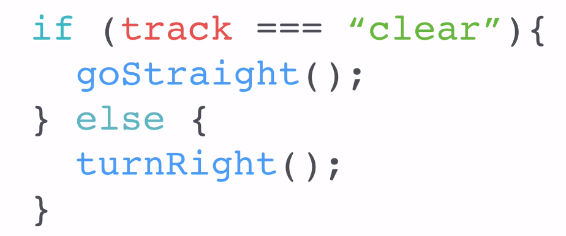

# JavaScript Notes

## Table of Contents

- [Difference Between Interpreter and Compiler](#difference-between-interpreter-and-compiler-video)
- [Data Types](#data-types)
  1. [Strings](#1-strings)
  2. [Numbers](#2-numbers)
  3. [Boolean](#3-boolean)
- [Variables](#variables)
- [Functions](#functions)
- [If and Else](#if-and-else)

### Difference between interpreter and Compiler [video](https://www.youtube.com/watch?v=_C5AHaS1mOA)

- JavaScript is an interpreter

- This is how JS code look like:

  

### Data Types:

#### 1. Strings:

- It contains text. This is how it looks like:

  ```javascript
  alert("hello"); // "hello" is the string data.
  ```

- Strings Concatenation:

  ```javascript
  var message = "Hello";
  var name = "Carlos";

  //Write you code below this line:

  alert(message + " " + name + "!"); // Outputs in Console: Hello Carlos!
  ```

- String feature `.length` challenge answer:

  (Create an alert that shows how many characters we typed and how many left after 280 characters.)

  ```javascript
  var text = prompt("Enter your Text here");
  var numberOfText = text.length;
  var remaining = 280 - numberOfText;

  alert(
    "You have written " +
      numberOfText +
      " characters, you have " +
      remaining +
      " left."
  );
  ```

- Feature `.slice(x,y)` challenge answer:

  (Create an alert that shows a max of 140 characters)

  ```javascript
  var text = prompt("Enter your text here");
  alert(text.slice(0, 140));
  ```

- Feature `.toUppercase()` and `.toLowerCase()` methods challenge answers:

  (Create an alert that shows the name of the person in the correct form Example: Carlos OR Bracho)

  ```javascript
  var name = prompt("What is your name?");
  firstLetter = name.slice(0, 1).toUpperCase();
  remainingLetters = name.slice(1, name.length).toLowerCase();

  alert("Hello, " + firstLetter + remainingLetters + " !");
  ```

#### 2. Numbers:

- It represents numerical values.

```javascript
1,2,3... // These are numbers data.
```

- To put long formulas in JS, we need to use the same logic as calculators.

  (Create an alert that calculates the age of dogs in human years)

  ```javascript
  var dogAge = prompt("Enter your dog's age");
  var humanAge = (dogAge - 2) * 4 + 21;
  alert("Your dog is " + humanAge + " in human years !");
  ```

- We can increment or decrement values by 1 using `++` and `--`.

  Example:

  ```javascript
  var x = 5;
  x++; //x is now = 6
  var y = 5;
  y--; //y is now = 4
  ```

- If we want to increase or decrease by more than 1, we can use `+=` or `-=` operators.

  Example:

  ```javascript
  var x = 5;
  x += 2; //x is now = 7
  var y = 5;
  y -= 2; //y is now = 3
  ```

#### 3. Boolean:

- Data type that describe data to be either `True` or `False`

### Variables:


- Example of variable:

  ```javascript
  var myName = "Carlos";
  var yourName = prompt("What is your name?");
  alert(
    "My name is " +
      myName +
      ", welcome to this learning project " +
      yourName +
      " !"
  ); //This code creates a message  box with a personalized greeting. Which shows how  we can use variables in alerts.
  ```

- Javascript Variables Exercise:

  Change the variables so a = "8" and b = "3".

  Do NOT change any of the existing code.

  You are NOT allowed to type any numbers.

  You should NOT redeclare the variables a and b.

  ```javascript
  var a = "3";
  var b = "8";

  /***********Do not change the code above 👆*******/
  //Write your code on lines 7 - 9:
  var c = a;
  a = b;
  b = c;
  /***********Do not change the code below 👇*******/

  console.log("a is " + a);
  console.log("b is " + b);
  //this changes the values so a = "8" and b = "3"
  ```

- Correct ways to name variables in JS:

  ```javascript
  var my123 = 123;
  var myName = "Carlos";
  var my_name = "Carlos";
  var useScoreFinal = 12; // This is the best way because it includes camelCase.
  ```

### Functions:



- `alert()` will show as a pop up on the website while `console.log()` will print out the message in the console, and it is usually used by the developer.

- `prompt()` Will create a pop up in which we can enter values.

- Within the the functions, we can add inputs:

  ```javascript
  function nameOfFunction(input) {}
  ```

  This is an example:
  

  As we can see bottles will be replaced by two, telling the program to get two bottles and calculating the `cost`

  - Exercise: Using this information, create a code that calculates the amount of bottles that can be bought.

  ```javascript
  function getMilk(money) {
    console.log("leaveHouse");
    console.log("moveRight");
    console.log("moveRight");
    console.log("moveUp");
    console.log("moveUp");
    console.log("moveUp");
    console.log("moveUp");
    console.log("moveRight");
    console.log("moveRight");

    var bottles = Math.floor(money / 1.5);

    console.log("buy " + bottles + " bottles of milk");
    console.log("moveLeft");
    console.log("moveLeft");
    console.log("moveDown");
    console.log("moveDown");
    console.log("moveDown");
    console.log("moveDown");
    console.log("moveLeft");
    console.log("moveLeft");
    console.log("enterHouse");
  }
  getMilk(5);
  ```

- The `Math.floor()` method rounds a number _DOWN_ to the nearest integer; however, `Math.round()` is more Mathematically correct.

- Exercise: Calculate the remaining months, weeks and days if the max age is 90.

  ```javascript
  function lifeInWeeks(age) {
    /************Don't change the code above************/

    var remainingYears = 90 - age;

    var months = remainingYears * 12;
    var weeks = remainingYears * 52;
    var days = remainingYears * 365;

    console.log(
      "You have " +
        days +
        " days, " +
        weeks +
        " weeks, and " +
        months +
        " months left."
    );

    /*************Don't change the code below**********/
  }

  lifeInWeeks(25);
  ```

  console View:

  ```console
  You have 23725 days, 3380 weeks, and 780 months left.
  ```

- the `return` value is used in function to end the execution of a function and give back a result.

  - This is an example that shows the use of `return`.

    ```javascript
    function getMilk(money) {
      console.log("leaveHouse");
      console.log("moveRight");
      console.log("moveRight");
      console.log("moveUp");
      console.log("moveUp");
      console.log("moveUp");
      console.log("moveUp");
      console.log("moveRight");
      console.log("moveRight");

      var bottles = Math.floor(money / 1.5);

      console.log("buy " + bottles + " bottles of milk");
      console.log("moveLeft");
      console.log("moveLeft");
      console.log("moveDown");
      console.log("moveDown");
      console.log("moveDown");
      console.log("moveDown");
      console.log("moveLeft");
      console.log("moveLeft");
      console.log("enterHouse");

      return money % 1.5; // Remainder of this division
    }
    var change = getMilk(4);
    console.log(change); // This will show the remainder in the console
    ```

- Coding exercise: Create BMI calculator using functions.

  ```javascript
  //Create your function below this line.
  //The first parameter should be the weight and the second should be the height.

  function bmiCalculator(weight, height) {
    var bmi = weight / (height * height);
    return Math.round(bmi);
  }

  console.log(bmiCalculator(65, 1.8));

  /* If my weight is 65Kg and my height is 1.8m, I should be able to call your function like this:
  
   var bmi = bmiCalculator(65, 1.8); 
  
   bmi should equal 20 when it's rounded to the nearest whole number.
  
   */
  ```

- `Math.random()` generates a random 16 digit decimal number between 0 and 0.9999999999999999 (It never reaches 1). Example: 0.364738274631829

  - Exercise using `Math.random()`: Create a Love Calculator in whic we enter two prompts for names and calculate a Random number that is a percentage.

    ```javascript
    var loveCalc = Math.round(Math.random() * 100 + 1); //It it important to add + 1 so it takes the value of 100 too.

    prompt("Enter your name");
    prompt("Enter the name of the person you love");
    alert("You are " + loveCalc + "% compatible");
    ```

### If and Else:

- `if` and `else` keywords are used in functions to tell JavaScript what to do if a certain condition is met.

  - This is an Example of how `if` and `else` look like:

    

  - As an example, We can use it in the Love Calculator above:

    ```Javascript
    var loveCalc = Math.round(Math.random() * 100 + 1);

    prompt("Enter your name");
    prompt("Enter the name of the person you love");

    if (loveCalc > 70) {
      alert(
        "You are " +
          loveCalc +
          "% compatible. You love each other like Kanye loves Kanye."
      );
    } else {
      alert("You are " + loveCalc + "% compatible.");
    }
    ```

- List of comparators and equality used with `if`:

  1. `===`: Is equal to.
  2. `!==`: Is not equal to.
  3. `<`: Is less than.
  4. `>`: Is greater than
  5. `<=`: Is less or equal to.
  6. `>=`: Is great or equal to.
